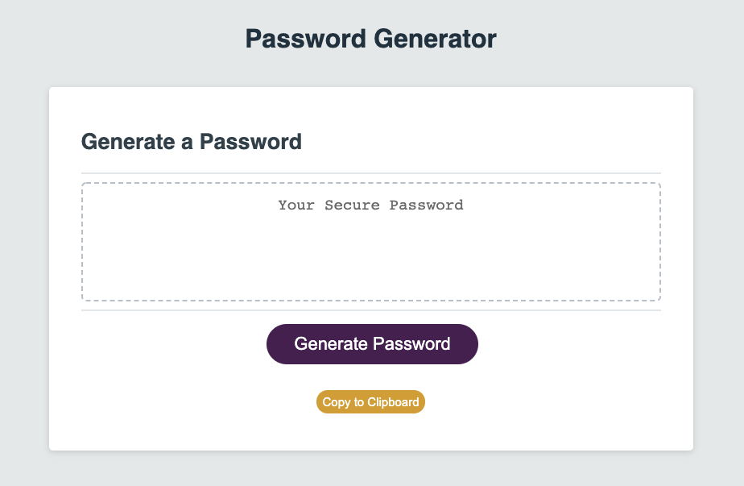

# Password Generator

## Purpose
    To randomly generate a password using the criteria the user submits. The password can include either all or one of the follow: uppercase letter, lowercase letters, special characters (!@#$%&*), and/or numbers. 

## Link 

https://nikcastle.github.io/password-generator/

## Screenshot

## Credits
Site created using starter code from University of Denver Full Stack Flex Boot Camp GitLab